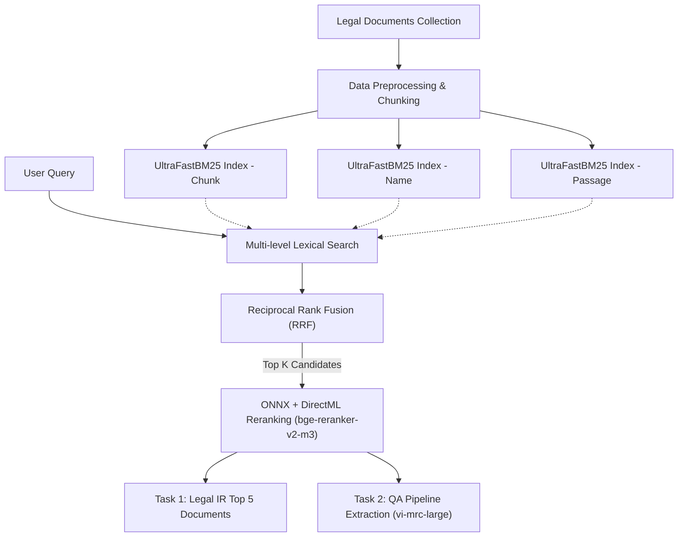

# Data Science UIT 2026 Solution - Legal Information Retrieval & Question Answering

This repository contains the optimized codebase for the Legal Information Retrieval (Task 1) and Answer Extraction (Task 2) tasks in the Data Science UIT competition.

## System Architecture

To overcome the massive bottleneck of searching over 288,000 legal chunks, the pipeline relies on a highly optimized CPU-GPU Hybrid architecture. The system utilizes a finely-tuned Lexical Retriever combined with an ONNX-accelerated Cross-Encoder and a dedicated MRC (Machine Reading Comprehension) model for QA.



## Key Breakthroughs & Optimizations

### 1. Multi-level BM25 & RRF Combination
Instead of relying on a single text search, we implemented `UltraFastBM25` across 3 different text granularities:
- **Chunk-level**: Matches specific clauses and articles.
- **Name-level**: Matches queries that ask for specific decrees or laws (e.g., "Luật Đất đai 2024").
- **Passage-level**: Matches broader contexts.
The results from these 3 indexes are combined using **Reciprocal Rank Fusion (RRF)**, yielding a highly robust initial candidate list without any AI inference cost.

### 2. ONNX Runtime & DirectML Acceleration
We ported the heavy `BAAI/bge-reranker-v2-m3` model to **ONNX format**. Instead of standard PyTorch, we leveraged `ORTModelForSequenceClassification` configured with the **DirectML Execution Provider (`DmlExecutionProvider`)** and maximum graph optimizations. This allows the model to fully utilize the Windows GPU (RTX 5050) hardware, drastically reducing inference time.

### 3. Compliant MRC/QA Pipeline
For Task 2 (Answer Extraction), we replaced standard LLMs with `nguyenvulebinh/vi-mrc-large`—a model formally allowed by the competition guidelines. This model is lightweight enough to run sequentially on the filtered chunks and works alongside a heuristic text expansion fallback to maximize the METEOR metric.

### 4. Aggressive Candidate Pruning (K-Reduction)
We reduced `TASK1_K_CANDIDATES` down to **50**, and `TASK2_K_CANDIDATES` to **20**. This massive reduction in candidate volume resulted in a **4x speedup** during the most expensive phase (GPU Cross-Encoding).

### 5. Checkpointing Mechanism
Because a single interruption could ruin hours of processing, we implemented an iterative JSON checkpointing system. This ensures that if the script crashes, restarting it instantly resumes from the exact batch it failed at.

## Requirements

```text
optimum[onnxruntime]
onnxruntime-directml
transformers
rank-bm25
numpy
```

## Running the Pipeline

Simply run the standalone script. The script automatically handles caching, indexing, checkpointing, and ZIP submission creation.

```bash
python solution.py
```
